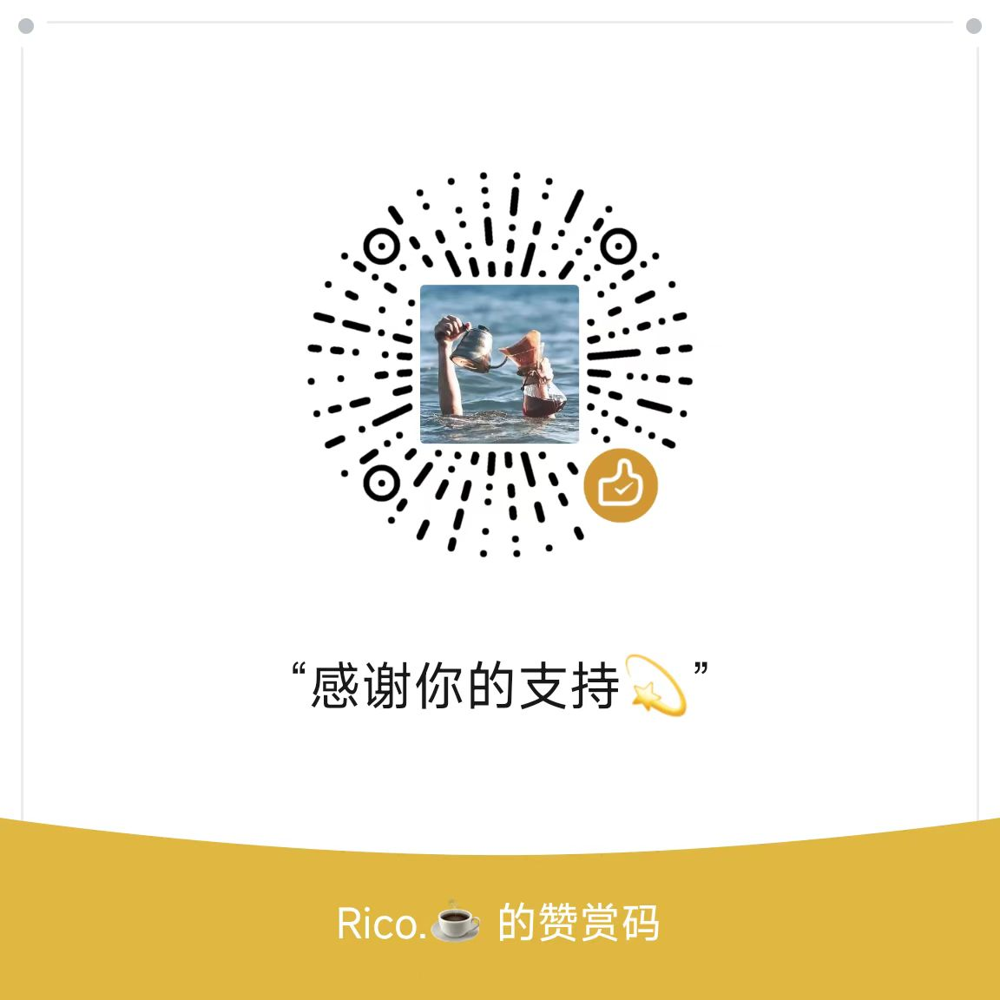

# 设计师的个人网站 Designer Portfolio Site

<a href="./README_EN.md" style="margin-bottom:16px">ENGLISH README</a>

一个基于 Astro 的作品集与博客模板，适合设计师、独立开发者和个人品牌网站使用。

<a href="https://ko-fi.com/T6T817U4KZ" target="_blank" style="display:inline-block;margin:.5rem auto 1rem;">
  
</a>

## 网站预览

- 线上地址：[ricoui.com](https://ricoui.com/)
- 仓库地址：[github.com/ricocc/public-portfolio-site](https://github.com/ricocc/public-portfolio-site)


## 技术栈

- Astro `6.4.4`
- `@astrojs/mdx`
- `@astrojs/sitemap`
- `@astrojs/rss`
- Sass
- TypeScript
- Sharp，用于 Astro 图片优化
- pnpm

### 字体选择

中文标题字体： 汇文明朝体 <a href="https://tieba.baidu.com/p/7193815211" target="_blank">官方链接</a>

正文字体：思源黑体 <a href="https://fonts.google.com/noto/specimen/Noto+Sans+SC?query=Noto+sans+sc" target="_blank">Google Font</a>

英文字体：Special Elite   <a href="https://fonts.google.com/specimen/Special+Elite" target="_blank">Google Font</a>

## 启动项目

```bash
pnpm install
pnpm dev
```

常用命令：

| 命令 | 说明 |
| :-- | :-- |
| `pnpm dev` | 启动本地开发服务，默认地址通常是 `localhost:4321` |
| `pnpm build` | 执行 `astro check` 并构建静态站点到 `dist/` |
| `pnpm preview` | 本地预览生产构建结果 |
| `pnpm astro check` | 运行 Astro 诊断与类型检查 |

## 环境变量

复制 `.env.example` 为 `.env`，然后按需填写：

```bash
PUBLIC_SITE_URL=https://example.com/
PUBLIC_SITE_NAME="Your Site Name"
PUBLIC_GA4_ID=
PUBLIC_UMAMI_ID=
```

- `PUBLIC_SITE_URL`：网站公开地址，用于 sitemap、RSS 和 SEO 信息。
- `PUBLIC_SITE_NAME`：网站名称。
- `PUBLIC_GA4_ID`：可选，Google Analytics 4 ID。
- `PUBLIC_UMAMI_ID`：可选，Umami Website ID。

如果不需要统计分析，可以留空 `PUBLIC_GA4_ID` 和 `PUBLIC_UMAMI_ID`。

## 内容与数据

主要内容配置集中在 `src/data/`：

- `src/data/content.ts`：站点基础信息、导航、SEO 文案、社交链接、页头文案等。
- `src/data/home.json`：首页作品卡片数据。
- `src/data/project.ts`：项目列表页数据。

首页作品数据示例：

```json
{
  "id": "10",
  "cover": "/assets/cover/cover-ricoui-starter.jpg",
  "useVideo": false,
  "title": "RicoUI Astro 启动模板",
  "desc": "Ricoui Starter Template",
  "url": "https://ricoui-saas-zh.netlify.app/",
  "detail": "https://ricoui-saas-zh.netlify.app/",
  "category": "web,recommend",
  "tag": "Web",
  "date": "2026-06-07",
  "mark": true,
  "opensource": false
}
```

字段说明：

- `cover`：封面图路径，当前首页封面放在 `public/assets/cover/`。
- `useVideo`：是否使用视频封面。
- `title`：项目名称。
- `desc`：项目描述。
- `url`：项目线上地址。
- `detail`：项目详情页路径，也可以填写外部链接。
- `category`：筛选分类，多个分类用英文逗号分隔，例如 `web,recommend`。
- `tag`：卡片标签。
- `date`：日期，用于展示和排序。
- `mark`：是否显示推荐标记。
- `opensource`：是否显示开源相关状态。

## 博客内容

博客已经迁移到 Astro 6 Content Layer API。

- 内容配置：`src/content.config.ts`
- 博客目录：`src/content/blog/`
- 支持格式：`*.md` 和 `*.mdx`

文章 frontmatter 示例：

```yaml
---
title: Article title
description: Article description
publishDate: 2026-06-07
read: 5
tags:
  - Astro
img: /preview-01.jpg
img_alt: Preview image
---
```

旧版 `src/content/config.ts` 已迁移为根目录下的 `src/content.config.ts`，并使用 `astro/loaders` 里的 `glob()` loader。

## 项目详情页

项目详情页放在：

```text
src/pages/detail/
```

如果作品卡片的 `detail` 填写站内路径，例如 `/detail/todo`，需要在 `src/pages/detail/` 下创建对应的 `.astro` 页面。详情页中的本地图片列表已使用 `import.meta.glob()`，并配合 Astro 的 `<Image />` 组件处理图片。

## GitHub Stars

右上角导航和移动端菜单已经加入 GitHub 图标与 star 数量组件：

```text
src/components/GitHubStars.astro
```

页面加载后会请求 GitHub 公共 API：

```text
https://api.github.com/repos/ricocc/public-portfolio-site
```

组件会使用仓库真实的 `stargazers_count` 更新页面上的 star 数量。未登录的 GitHub API 有访问频率限制，如果部署后访问量较大，建议改成带缓存的服务端接口。

## 字体

- 中文正文：Noto Sans SC / 思源黑体
- 英文字体：Special Elite / Inter / Inconsolata
- 部分中文标题为了减少运行时字体体积，使用 SVG 方式嵌入。

## 项目结构

```text
/
├─ public/
│  ├─ assets/
│  │  └─ cover/
│  ├─ plugins/
│  └─ favicon.png
├─ src/
│  ├─ assets/
│  ├─ components/
│  ├─ content/
│  │  └─ blog/
│  ├─ data/
│  ├─ effects/
│  ├─ layouts/
│  ├─ pages/
│  ├─ styles/
│  └─ content.config.ts
├─ astro.config.mjs
├─ package.json
└─ pnpm-lock.yaml
```

## 部署

项目会构建为静态站点：

```bash
pnpm build
```

构建产物位于 `dist/`，可以部署到 Netlify、Vercel、Cloudflare Pages、GitHub Pages 或其他静态托管平台。

## 关于作者

我是 Rico，网页 / UI 设计师，目前主要专注于网页视觉和独立开发。我平时在博客 [Rico's Blog](https://blog.ricocc.com/) 更新内容，也可以关注我的小红书 [@Rico的设计漫想](https://www.xiaohongshu.com/user/profile/5f2b6903000000000101f51f) 和 X [@ricouii](https://x.com/ricouii)。

## 其他模板

- **SaaS Template**：[https://github.com/ricocc/ricoui-saas-template](https://github.com/ricocc/ricoui-saas-template)
- **Portfolio Template**：[https://github.com/ricocc/ricoui-portfolio](https://github.com/ricocc/ricoui-portfolio)
- **Blog Template**：[https://github.com/ricocc/public-portfolio-site](https://github.com/ricocc/public-portfolio-site)

## 支持作者

如果这个模板对你有帮助，一点点支持就可以继续激励我维护和创作，感谢。



## License

[MIT](./LICENSE)
